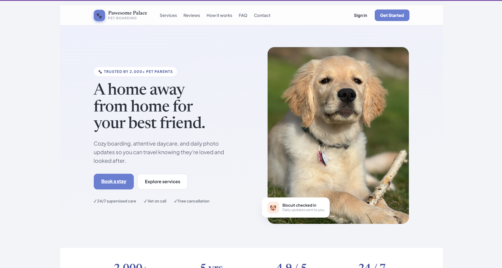
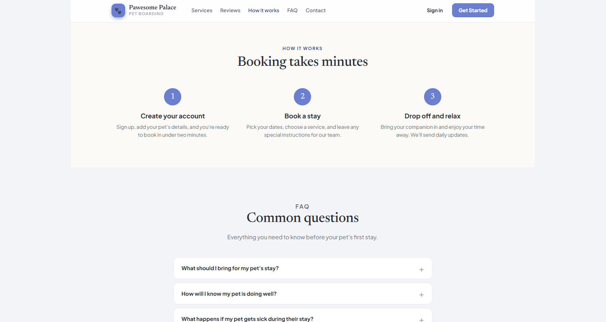
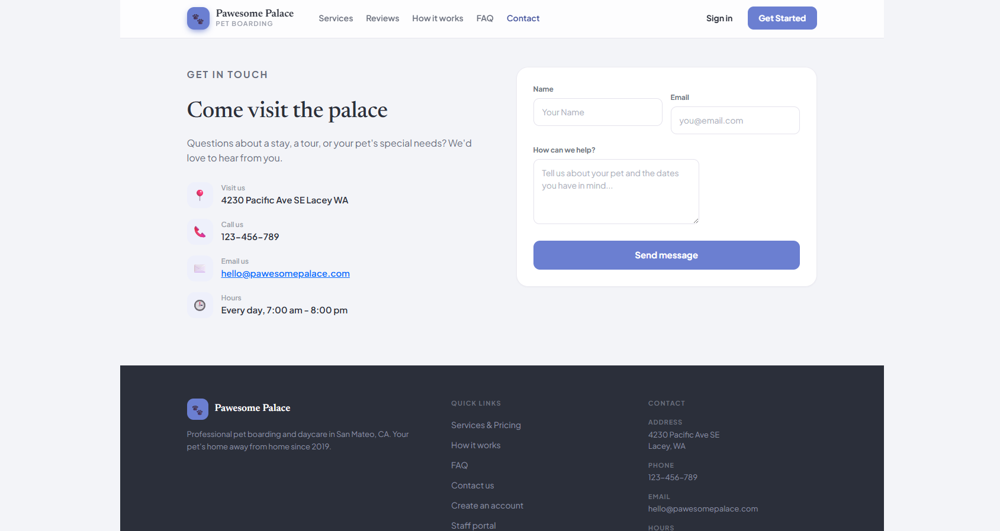

# Pawesome Palace Pet Boarding

A full-stack pet boarding management web application built with ASP.NET MVC 5, featuring a customer-facing portal and a staff admin dashboard.

---

## Screenshots

### Landing Page
<!-- Screenshot: home page hero section -->


### About Page
<!-- Screenshot: about page -->


### Business Hours
<!-- Screenshot: hours page -->


### Contact Us
<!-- Screenshot: contact form page -->


---

## Customer Portal

### My Account Dashboard
<!-- Screenshot: customer dashboard showing pet count and active bookings -->


### My Pets
<!-- Screenshot: pet list page -->


### Add a Pet
<!-- Screenshot: pet creation form with medical and feeding fields -->


### Pet Details
<!-- Screenshot: full pet profile view -->


### Edit Pet
<!-- Screenshot: pet edit form -->


### My Bookings
<!-- Screenshot: booking list with status filter tabs (All / Pending / Confirmed / Completed / Cancelled) -->


### Create a Booking
<!-- Screenshot: booking form with service selection and date picker -->


### Booking Details
<!-- Screenshot: booking detail view with drop-off/pick-up times and status -->


### Cancel a Booking
<!-- Screenshot: cancellation request form with reason field -->


---

## Authentication & Account Management

### Register
<!-- Screenshot: registration form -->


### Login
<!-- Screenshot: login form -->


### Forgot Password
<!-- Screenshot: password recovery form -->


### Manage Profile
<!-- Screenshot: profile page with personal info and password change -->


---

## Admin Dashboard

### Dashboard Overview
<!-- Screenshot: admin index with KPIs — pending bookings, today's check-ins/outs, monthly revenue -->


### Schedule
<!-- Screenshot: staff schedule view with Today / This Week / Next Week filter -->


### Review Bookings
<!-- Screenshot: booking approval workflow with Approve / Decline / Flag actions -->


### Review Cancellations
<!-- Screenshot: cancellation refund decision interface -->


### Booking Management
<!-- Screenshot: admin bookings list with search and status filters -->


### Booking Detail (Admin)
<!-- Screenshot: full booking record with admin notes and status controls -->


### Pet Inventory
<!-- Screenshot: pets list with medical alert flags -->


### Pet Detail (Admin)
<!-- Screenshot: pet profile with owner info and emergency contacts -->


### User Management
<!-- Screenshot: users list with search and suspension tracking -->


### User Detail (Admin)
<!-- Screenshot: user profile with emergency contact details -->


### Services Management
<!-- Screenshot: services list with active/inactive toggle and pricing -->


### Contact Submissions
<!-- Screenshot: contact form submissions filtered by resolved/unresolved -->


### Contact Detail (Admin)
<!-- Screenshot: individual contact submission with resolution tracking -->


---

## Features

**Customer Portal**
- Register, log in, and manage your profile
- Add and manage multiple pets with detailed medical and feeding information
- Create, view, edit, and cancel bookings
- Select from available services with per-night pricing
- View drop-off/pick-up times and real-time booking status

**Admin Dashboard**
- KPI overview: pending bookings, today's check-ins/outs, monthly revenue
- Approve, decline, or flag booking requests
- Manage cancellation requests and refund decisions
- Staff schedule view filtered by day or week
- Full pet inventory with medical alert flags
- User management with profile and emergency contact details
- Service CRUD with active/inactive toggling
- Contact form submission tracking and resolution

---

## Tech Stack

| Layer | Technology |
|---|---|
| Backend | ASP.NET MVC 5.3 / .NET Framework 4.8.1 |
| ORM | Entity Framework 6.5.1 (Code-First) |
| Database | SQL Server LocalDB |
| Auth | ASP.NET Identity 2.2.4 + OWIN (cookie auth, 2FA support) |
| Frontend | Bootstrap 5.3.3, jQuery 3.7.1, Razor Views |
| Testing | NUnit 4.3.2 (.NET 9.0 test project) |

---

## Getting Started

**Prerequisites:** Visual Studio 2022, SQL Server LocalDB

```bash
# Restore packages and build
msbuild WebAppTemplate.sln

# Apply database migrations (run in Visual Studio Package Manager Console)
Update-Database
```

Run with **F5** in Visual Studio — launches at `https://localhost:44377/` via IIS Express.

**Run tests:**
```bash
dotnet test WebAppTemplateTests/WebAppTemplateTests.csproj
```

---

## Author

**Joey Fausto** — [GitHub](https://github.com/NinjaPanda351/PetBoardingWebsite)
